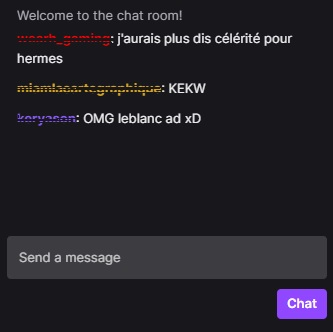

# Interview test

Build a twitch-like chat with socket.io

## Commands
### Start projetct
```shell
yarn start
```

### Run tests
```shell
yarn test
```

### Run lint
```shell
yarn lint
```

## Mockup


## TODO ❌✔️
✔️ Clone project  
✔️ Mockup Twitch  
✔️ Install typescript  
✔️ Install and configure eslint/prettier  
✔️ Install styled-components  
✔️ Project structure  
✔️ Components
  - ChatContainer
  - ChatMessage
  - ChatInput
  - ChatButton  

✔️ Hooks
  - useSocketIO

✔️ Unit tests  
✔️ ENHANCEMENT: Show time of message  
❌ ENHANCEMENT: Scroll to bottom on every new message  
❌ ENHANCEMENT: App context for user, displayTimestamp, ...  